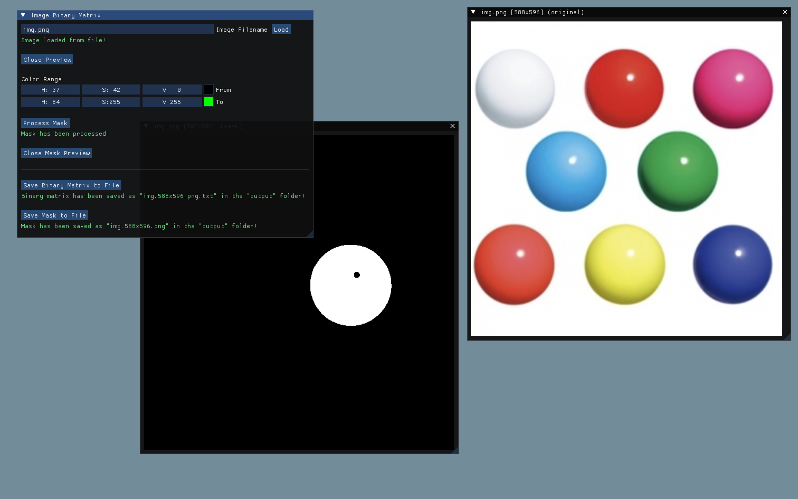
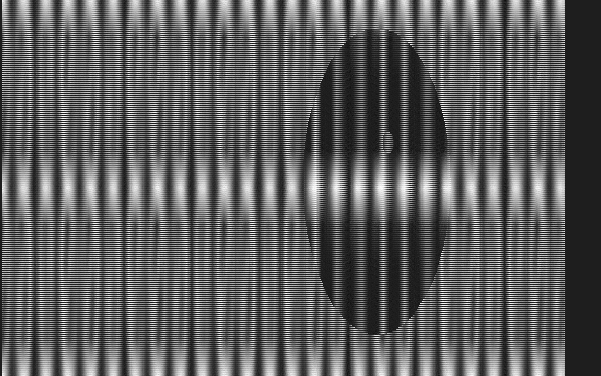

# Image Binary Matrix

A small application to fetch an image mask based on a specified color range and generate a binary matrix corresponding to the mask.

## Requirements

- C++17 compiler
- [CMake](https://cmake.org/download) >= 3.15
- [Python](https://www.python.org/downloads) 3
- [Conan](https://conan.io/downloads) 2

## Build & Run

### Build

> If you are building for the first time, please run `conan profile detect` and `conan profile show` to make sure that the `compiler.cppstd` option includes the `17` version of C++.

```
make build
```

OR

```
python ./scripts/build.py
```

OR

```
python3 ./scripts/build.py
```

> P.S. The initial build may take a considerable amount of time.

### Run

`make run` or `python ./scripts/run.py` or `python3 ./scripts/run.py`

## Technologies

- C++17
- GLEW
- GLFW
- ImGui
- OpenCV

## Screenshots

### Application GUI



### Binary Matrix Output


